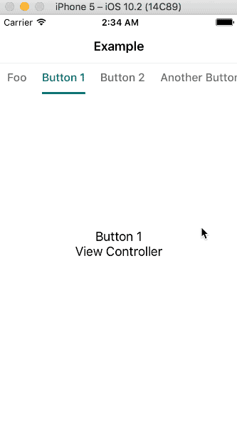
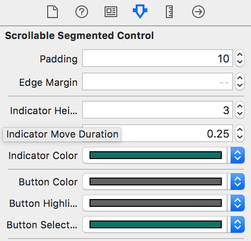

# WDScrollableSegmentedControl

[](https://travis-ci.org/Wildog/WDScrollableSegmentedControl)
[](http://cocoapods.org/pods/WDScrollableSegmentedControl)
[](http://cocoapods.org/pods/WDScrollableSegmentedControl)
[](http://cocoapods.org/pods/WDScrollableSegmentedControl)

Minimal segmented control, scrollable, customizable, animatable, easy as hell to use.

Works perfectly with [YTPageController](https://github.com/yeatse/YTPageController):


## Usage

Interface Builder is all you need:



... or you prefer code:

```Objective-C

WDScrollableSegmentedControl *segmentedControl = [[WDScrollableSegmentedControl alloc] initWithFrame:frame];

// space between buttons
segmentedControl.padding = 10.;

// space before first button and after last button
segmentedControl.edgeMargin = 0.;

// indicator height
segmentedControl.indicatorHeight = 3.;

// indicator animation duration
segmentedControl.indicatorMoveDuration = 0.25;

// font
segmentedControl.font = [UIFont systemFontOfSize:16.];

// colors
segmentedControl.indicatorColor = [UIColor blackColor];
segmentedControl.buttonColor = [UIColor blackColor];
segmentedControl.buttonHighlightColor = [UIColor grayColor];
segmentedControl.buttonSelectedColor = [UIColor blueColor];

// use this method if you want to change colors dynamically
[segmentedControl setButtonColor:[UIColor greenColor] forState:UIControlStateNormal];

```

Finally set the data and delegate:

```Objective-C
scrollSegment.buttons = @[@"Foo", @"Button 1", @"Button 2", @"Another Button", @"Bar", @"Button Again", @"Finally"];
scrollSegment.delegate = self;

// this is what your delegate should implement
- (void)didSelectButtonAtIndex:(NSInteger)index;
```

If you use it in a navigation controller, don't forget to set:

```Objective-C
self.automaticallyAdjustsScrollViewInsets = NO;
```

Or it will mess with contentSize of the segmented control.

## Example

To run the example project, clone the repo, and run `pod install` from the Example directory first.

## Requirements

iOS 8.0 or above.

## Installation

WDScrollableSegmentedControl is available through [CocoaPods](http://cocoapods.org). To install
it, simply add the following line to your Podfile:

```ruby
pod "WDScrollableSegmentedControl"
```

## Author

Wildog, i@wil.dog

## License

WDScrollableSegmentedControl is available under the MIT license. See the LICENSE file for more info.
